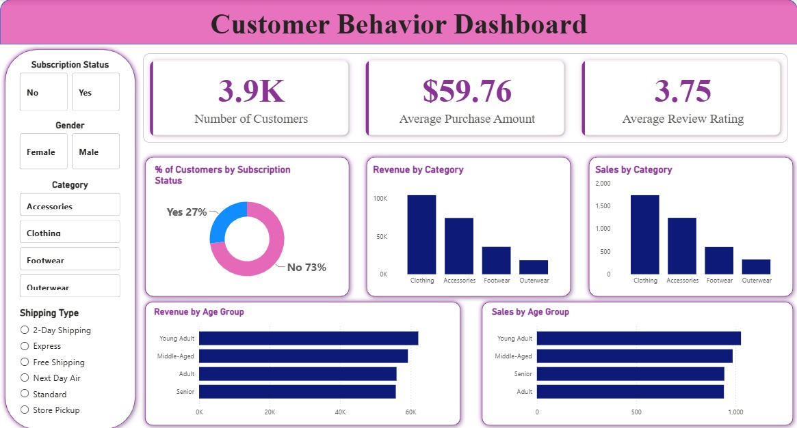

# Customer Shopping Behavior Analysis

An end-to-end data analytics project that cleans, analyzes, and visualizes **3,900 customer transactions** to uncover spending patterns, customer segments, product preferences, and subscription behavior. This project demonstrates the complete analytics workflow—from **data cleaning in Python** to **business analysis in PostgreSQL** and **interactive visualization in Power BI**.

---

# Dashboard Preview

<p align="center">
  
</p>

---

# Project Overview

Businesses collect large volumes of customer transaction data every day, but raw data alone provides little value without proper analysis.

This project explores shopping behavior across **3,900 customer transactions** to answer important business questions such as:

- Which customer segments generate the highest revenue?
- Which product categories perform the best?
- Are subscribers spending more than non-subscribers?
- Which products depend heavily on discounts?
- Which age groups contribute the most revenue?

The project follows a complete analytics pipeline:

**Raw Dataset → Python Data Cleaning → PostgreSQL Analysis → Power BI Dashboard → Business Insights & Recommendations**

---

# Objectives

- Clean and preprocess raw customer transaction data
- Perform exploratory data analysis (EDA)
- Write SQL queries to answer business questions
- Create meaningful customer segments
- Build an interactive Power BI dashboard
- Generate actionable business recommendations

---

# Tech Stack

| Category | Tools |
|----------|-------|
| Programming | Python |
| Data Cleaning | Pandas |
| Database | PostgreSQL |
| SQL Concepts | Joins, CTEs, Window Functions, Aggregations |
| Visualization | Power BI |
| Environment | Jupyter Notebook, pgAdmin 4 |

---

# Dataset Summary

**Dataset Size**

- **Rows:** 3,900
- **Columns:** 18

### Features

### Customer Information

- Customer ID
- Age
- Gender
- Location
- Subscription Status

### Purchase Information

- Item Purchased
- Category
- Purchase Amount
- Season
- Size
- Color

### Shopping Behavior

- Discount Applied
- Promo Code Used
- Previous Purchases
- Purchase Frequency
- Review Rating
- Shipping Type

### Data Quality

- Missing values found in **Review Rating**
- Total missing values: **37**
- Missing ratings were imputed using the **median rating within each product category**

---

# Data Cleaning & Feature Engineering (Python)

The dataset was cleaned using **Pandas** before loading it into PostgreSQL.

### Cleaning Steps

- Loaded dataset using Pandas
- Inspected data types and summary statistics
- Identified missing values
- Filled missing review ratings using category-wise median
- Renamed columns to snake_case
- Removed redundant columns
- Checked duplicate records
- Prepared the dataset for SQL analysis

### Feature Engineering

Created additional variables including:

- **Age Group**
  - Young Adult
  - Adult
  - Middle-Aged
  - Senior

- Purchase Frequency (Days)

---

# SQL Business Analysis

Ten business-driven SQL queries were written to answer important analytical questions.

## Business Questions Answered

### 1. Revenue by Gender

Compared total revenue generated by male and female customers.

---

### 2. High-Spending Discount Users

Identified customers who used discounts but still spent above the average purchase amount.

---

### 3. Top Rated Products

Ranked products based on average review rating.

---

### 4. Shipping Type Comparison

Compared average purchase amount between:

- Standard Shipping
- Express Shipping

---

### 5. Subscribers vs Non-Subscribers

Compared:

- Total Revenue
- Average Purchase Amount

between subscribers and non-subscribers.

---

### 6. Discount Dependent Products

Found products that rely most heavily on discounts.

---

### 7. Customer Segmentation

Segmented customers into:

- New
- Returning
- Loyal

using purchase history.

---

### 8. Top Products within Each Category

Used SQL Window Functions to rank the top three products in every category.

---

### 9. Repeat Buyers & Subscription Analysis

Determined whether customers with five or more purchases are more likely to subscribe.

---

### 10. Revenue by Age Group

Calculated revenue contribution of different age groups.

---

# Power BI Dashboard

The dashboard provides an interactive overview of customer shopping behavior.

### KPI Cards

- Number of Customers
- Average Purchase Amount
- Average Review Rating

### Interactive Filters

- Subscription Status
- Gender
- Product Category
- Shipping Type

### Dashboard Visualizations

- Revenue by Category
- Sales by Category
- Revenue by Age Group
- Sales by Age Group
- Customer Subscription Distribution
- KPI Summary Cards

---

# Key Insights

### Customer Base

- Total Customers: **3,900**
- Subscribers: **27%**
- Non-Subscribers: **73%**

---

### Revenue

- Male customers generated over **2×** the revenue of female customers.

- Clothing generated the highest total revenue.

---

### Customer Segmentation

- Approximately **80%** of customers were classified as Loyal Customers.

---

### Product Performance

The products with the highest discount dependency include:

- Hat
- Sneakers
- Coat
- Sweater
- Pants

---

### Age Analysis

Young Adults and Middle-Aged customers contributed the highest revenue.

---

### Shipping

Customers selecting Express Shipping spent slightly more on average than those using Standard Shipping.

---

# Business Recommendations

### Increase Subscription Adoption

With 73% of customers not subscribed, targeted membership campaigns can significantly improve recurring revenue.

---

### Reward Loyal Customers

Introduce loyalty rewards and exclusive offers for repeat buyers.

---

### Optimize Discount Strategy

Reduce excessive discounting on highly discount-dependent products to protect profit margins.

---

### Promote Best-Selling Products

Feature top-rated and top-selling products prominently in marketing campaigns.

---

### Target High-Value Customer Segments

Focus advertising budgets on:

- Young Adults
- Middle-Aged Customers
- Express Shipping Customers

to maximize return on investment.

---

# Repository Structure

```
Customer-Behavior-Analysis/
│
├── assets/
│   └── customer-behavior-dashboard.jpg
│
├── data/
│   └── customer_shopping_data.csv
│
├── notebooks/
│   └── data_cleaning_eda.ipynb
│
├── sql/
│   └── business_queries.sql
│
├── dashboard/
│   └── customer_behavior_dashboard.pbix
│
├── README.md
│
└── requirements.txt
```

---

# How to Run the Project

## 1. Clone the Repository

```bash
git clone https://github.com/Muhammad123-cell/Customer-Behavior-Analysis.git
```

---

## 2. Install Dependencies

```bash
pip install pandas numpy matplotlib jupyter
```

---

## 3. Run the Python Notebook

Open:

```
notebooks/data_cleaning_eda.ipynb
```

Execute all cells to clean and prepare the dataset.

---

## 4. Load Data into PostgreSQL

Import the cleaned CSV into PostgreSQL and execute:

```
sql/business_queries.sql
```

---

## 5. Open Power BI

Open:

```
dashboard/customer_behavior_dashboard.pbix
```

Interact with filters and visualizations.

---

# Skills Demonstrated

- Data Cleaning
- Exploratory Data Analysis (EDA)
- SQL Query Writing
- PostgreSQL
- Window Functions
- Common Table Expressions (CTEs)
- Data Visualization
- Dashboard Design
- Business Intelligence
- Customer Segmentation
- Feature Engineering
- Business Analytics

---

# Author

**Muhammad Bin Faisal**

**Data Analyst | SQL | Python | Power BI**

Email: **mbfaisal85@gmail.com**

🔗 GitHub: **https://github.com/Muhammad123-cell**

---
